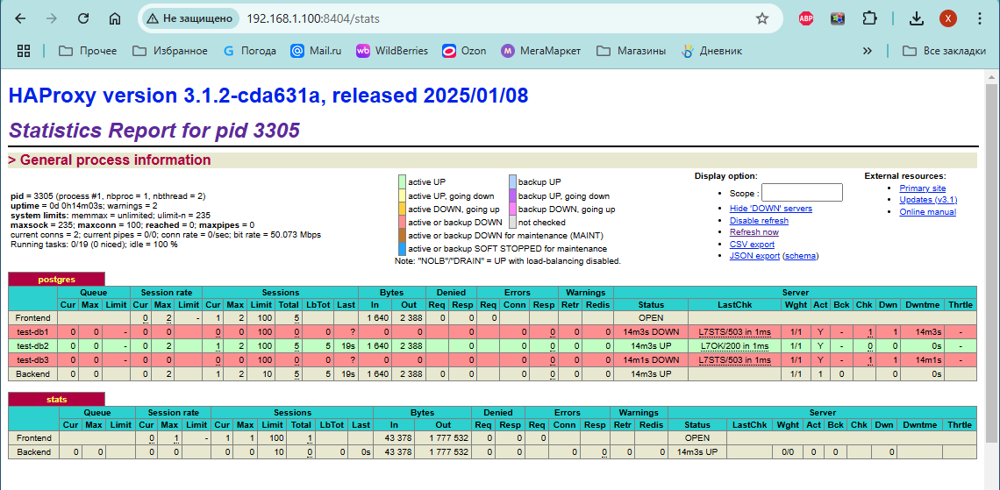
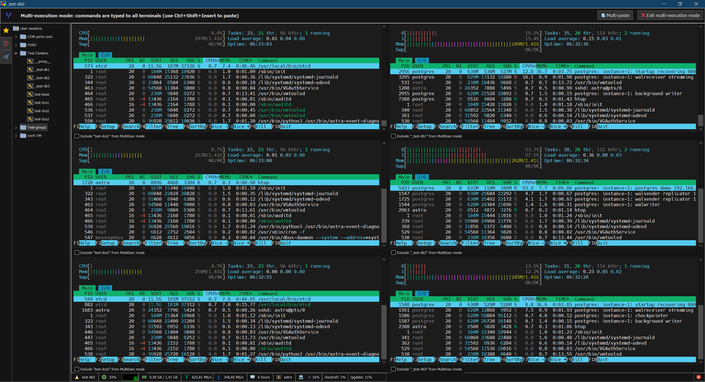

### __Домашнее задание - Кластер Patroni__

#### __План и оборудование__

__- настроим 7 виртуальных машин__
```
- три хоста - кластер DSC ( ETCD )  - [ test-dcs1, test-dcs2, test-dcs3 ]
- три хоста - кластер СУБД  ( Patroni + PostgreSQL ) - [ test-db1, test-db2, test-db3 ]
- хост HaProxy - [ test-proxy ]

- сеть для DCS сделаем отдельной  [ 192.168.1.0 ]
- поэтому на хостах СУБД по две сетевые и по два адреса из разных сегментов [ 192.168.1.0, 192.168.20.0 ]
- на Proxy также два сегмента сети  [ 192.168.20.100 192.168.1.100 ] 
- Для подключения к кластеру (второй адрес прокси сервера) - 192.168.1.100:7432
```

- настройки файлов hosts
```
  -----  для хостов DCS
          192.168.1.151   test-dcs1  test-dcs1.test.local
          192.168.1.152   test-dcs2  test-dcs2.test.local
          192.168.1.153   test-dcs3  test-dcs3.test.local
          192.168.1.141   test-db1   test-db1.test.local
          192.168.1.142   test-db2   test-db2.test.local
          192.168.1.143   test-db3   test-db3.test.local

  -----  для хостов СУБД
          192.168.1.151   test-dcs1  test-dcs1.test.local
          192.168.1.152   test-dcs2  test-dcs2.test.local
          192.168.1.153   test-dcs3  test-dcs3.test.local
          192.168.20.100   test-proxy  test-proxy.test.local
          192.168.20.141   test-db1   test-db1.test.local
          192.168.20.142   test-db2   test-db2.test.local
          192.168.20.143   test-db3   test-db3.test.local

  -----  для прокси
          192.168.1.100   test-proxy  test-proxy.test.local
          192.168.20.141   test-db1   test-db1.test.local
          192.168.20.142   test-db2   test-db2.test.local
          192.168.20.143   test-db3   test-db3.test.local
```

- программное обеспечение
```
- Astra Linux 1.8  (based on Debian 12)
- Etcd 3.5.17
- Patroni 4.0.4 (Python 3.11)
- PostgresPro 1C 16  (free edition PostgresPro)
- HaProxy 3.1.2
```

#### __Установим дополнительные пакеты__

```
sudo apt install wget
```


#### __Установка и настройка ETCD__

__- на 3-х хостах кластера DCS разворачиваем пакет программы ETCD__<br>
_( хост 192.168.1.244 - локальный репозиторий по ftp )_
```
wget ftp://192.168.1.244/etcd-3.5.17.tar.gz
sudo tar -zxvf etcd-3.5.17.tar.gz -C /
sudo groupadd etcd
sudo useradd -m -d /var/lib/etcd -s /usr/sbin/nologin -g etcd etcd 
sudo mkdir ~etcd/default
sudo chown etcd: ~etcd/default
```
_// бинарные файлы в каталоге - /var/local/bin/_<br>
_// шаблон для systemd  -  /usr/lib/systemd/system/etcd.service_

__- записываем файл конфигурации ( меняя параметры для каждого хоста )__<br>
_( /etc/default/etcd )_
```
# ETCD_NAME="test-dcs1"  - set in etcd.service as hostname
ETCD_LISTEN_CLIENT_URLS="http://192.168.1.151:2379,http://127.0.0.1:2379"
ETCD_ADVERTISE_CLIENT_URLS="http://192.168.1.151:2379"
ETCD_LISTEN_PEER_URLS="http://192.168.1.151:2380"
ETCD_INITIAL_ADVERTISE_PEER_URLS="http://192.168.1.151:2380"
ETCD_INITIAL_CLUSTER_TOKEN="etcd-postgres-cluster"
ETCD_INITIAL_CLUSTER="test-dcs1=http://192.168.1.151:2380,test-dcs2=http://192.168.1.152:2380,test-dcs3=http://192.168.1.153:2380"
ETCD_INITIAL_CLUSTER_STATE="new"
# ETCD_DATA_DIR="/var/lib/etcd/default"  - set in etcd.service 
ETCD_ELECTION_TIMEOUT="10000"
ETCD_HEARTBEAT_INTERVAL="2000"
ETCD_INITIAL_ELECTION_TICK_ADVANCE="false"
ETCD_ENABLE_V2="true"
```

__- файл настройки службы уже есть из пакета - и запускаем службы ETCD на кластере DCS__<br>
_( /usr/lib/systemd/system/etcd.service )_
```
[Unit]
Description=etcd - highly-available key value store
Documentation=https://etcd.io/docs
Documentation=man:etcd
After=network.target
Wants=network-online.target

[Service]
Environment=DAEMON_ARGS=
Environment=ETCD_NAME=%H
Environment=ETCD_DATA_DIR=/var/lib/etcd/default
EnvironmentFile=-/etc/default/%p
Type=notify
User=etcd
PermissionsStartOnly=true
ExecStart=/usr/local/bin/etcd $DAEMON_ARGS
Restart=on-abnormal
#RestartSec=10s
LimitNOFILE=65536

[Install]
WantedBy=multi-user.target
Alias=etcd2.service
```

__- запускаем службы на каждом хосте__
```
sudo systemctl daemon-reload
sudo systemctl enable etcd
sudo systemctl start etcd
```

__- проверяем состояние кластера DCS и его хосты__
```
  -- список хостов кластера
astra@test-dcs1:~$ ETCDCTL_API=2 etcdctl member list
504ffa3d42ead29c: name=test-dcs1 peerURLs=http://192.168.1.151:2380 clientURLs=http://192.168.1.151:2379 isLeader=true
56f19cfb6ceccf5f: name=test-dcs2 peerURLs=http://192.168.1.152:2380 clientURLs=http://192.168.1.152:2379 isLeader=false
9ffbb47380af1c79: name=test-dcs3 peerURLs=http://192.168.1.153:2380 clientURLs=http://192.168.1.153:2379 isLeader=false


  -- определить статус хостов
astra@test-dcs1:~$ etcdctl endpoint status --cluster -w table
+---------------------------+------------------+---------+---------+-----------+------------+-----------+------------+--------------------+--------+
|         ENDPOINT          |        ID        | VERSION | DB SIZE | IS LEADER | IS LEARNER | RAFT TERM | RAFT INDEX | RAFT APPLIED INDEX | ERRORS |
+---------------------------+------------------+---------+---------+-----------+------------+-----------+------------+--------------------+--------+
| http://192.168.1.151:2379 | 504ffa3d42ead29c |  3.5.17 |   25 kB |      true |      false |         2 |         12 |                 12 |        |
| http://192.168.1.152:2379 | 56f19cfb6ceccf5f |  3.5.17 |   25 kB |     false |      false |         2 |         12 |                 12 |        |
| http://192.168.1.153:2379 | 9ffbb47380af1c79 |  3.5.17 |   25 kB |     false |      false |         2 |         12 |                 12 |        |
+---------------------------+------------------+---------+---------+-----------+------------+-----------+------------+--------------------+--------+

-- состояние кластера
astra@test-dcs2:~$ etcdctl endpoint health --cluster -w table
+---------------------------+--------+-------------+-------+
|         ENDPOINT          | HEALTH |    TOOK     | ERROR |
+---------------------------+--------+-------------+-------+
| http://192.168.1.151:2379 |   true |  2.451401ms |       |
| http://192.168.1.153:2379 |   true | 23.638891ms |       |
| http://192.168.1.152:2379 |   true |  2.220571ms |       |
+---------------------------+--------+-------------+-------+
```

#### __Установка СУБД__

__- на 3-х хостах кластера СУБД - разворачиваем PostgresPro 1C 17__<br>
_-- останавливаем службу и проверяем установленные Локальные языки_<br>
_-- во время инициализации кластера PostgreSQL будет определять текущую "локаль" и использует её_<br>
```
wget https://repo.postgrespro.ru/1c/1c-17/keys/pgpro-repo-add.sh
chmod +x ./pgpro-repo-add.sh
sudo ./pgpro-repo-add.sh 
sudo apt -y install postgrespro-1c-17 postgrespro-1c-17-dev
...
  -- останавливаем и выключаем автозагрузку
sudo systemctl stop postgrespro-1c-17
sudo systemctl disable postgrespro-1c-17

  -- Patroni сам будет запускать сервер PostgreSQL
```

#### __Создание диска для базы__

__- размечаем раздел а LVM и форматируем XFS__
```
astra@test-db1:~$ lsblk
NAME   MAJ:MIN RM  SIZE RO TYPE MOUNTPOINTS
sda      8:0    0 15,6G  0 disk
├─sda1   8:1    0    1G  0 part /boot/efi
└─sda2   8:2    0 14,6G  0 part /
sdb      8:16   0   12G  0 disk
sr0     11:0    1 1024M  0 rom
astra@test-db1:~$ sudo pvcreate /dev/sdb
  Physical volume "/dev/sdb" successfully created.
astra@test-db1:~$ sudo vgcreate vg1 /dev/sdb
  Volume group "vg1" successfully created
astra@test-db1:~$ sudo lvcreate -l 100%FREE -n pgdata vg1
  Logical volume "pgdata" created.
astra@test-db1:~$ sudo mkfs.xfs /dev/vg1/pgdata
meta-data=/dev/vg1/pgdata        isize=512    agcount=4, agsize=786176 blks
         =                       sectsz=512   attr=2, projid32bit=1
         =                       crc=1        finobt=1, sparse=1, rmapbt=0
         =                       reflink=1    bigtime=1 inobtcount=1 nrext64=0
data     =                       bsize=4096   blocks=3144704, imaxpct=25
         =                       sunit=0      swidth=0 blks
naming   =version 2              bsize=4096   ascii-ci=0, ftype=1
log      =internal log           bsize=4096   blocks=16384, version=2
         =                       sectsz=512   sunit=0 blks, lazy-count=1
realtime =none                   extsz=4096   blocks=0, rtextents=0
```

__- настраиваем монтирование__
```
sudo mkdir /pgdata
sudo -- sh - c "echo '/dev/vg1/pgdata /pgdata  xfs  defaults   1 2' >> /etc/fstab"
sudo systemctl daemon-reload
sudo mount -a
sudo chown -R postgres: /pgdata
sudo chmod 750 /pgdata
```

#### __Установка Patroni__

__- загружаем подготовленный пакет Patroni для оффлайн установки и дополниетльные пакеты__<br>
```
   -- ( в данном пакете есть драйвера и для ETCD и для CONSUL )<br>
   -- Patroni - программа на Python и зависимые пакеты зависят от версии Python<br>
   -- ( на старых версиях будут сильно устаревшие пакеты библиотек Python )<br>
   -- SUSE Enterprise Linux 15 - Python 3.6 ( есть оффициальный пакет с Python 3.11, но есть ?? )<br>
   -- Astra Linux 1.7 - Python 3.7  ( сложно обновить до новой версии )<br>
   -- Astra Linux 1.8 - Python 3.11   ( как и в Debian 12 )<br>
   -- Ubuntu 2404 - Рython 3.12<br>
   -- Новые версии Linux запрещают установку новых пакетов Python - не входящих в стандартные репозитории
   --     надо использовать VENV ( но это другая история - см. приложение - patroni+consul )
   --     на данном тестировании меняем системные пакеты
```

```
sudo apt -y install python3-pip

wget ftp://192.168.1.244/patroni-2025-01.tar.gz
tar -zxvf patroni-2025-01.tar.gz
```

__- скрипт установки и обновления Patroni оффлайн - pupdate.sh__<br>
_(если параметр 'etcd' или 'etcd3' устанавливается клиент для etcd - иначе - клиент для consul)_<br>
```
#!/bin/bash

# install or update Patroni

#sudo apt -y install python3-pip

OPTI='--no-index --upgrade --force-reinstall --break-system-packages --root-user-action=ignore'
WHLPATH=./whl311

sudo python3 -m pip install --upgrade $OPTI -f $WHLPATH/ pip
sudo pip install $OPTI -f $WHLPATH/ setuptools
sudo pip install $OPTI -f $WHLPATH/ wheel


case "$1" in
  etcd)
    #-- for ETCD - use this pack  
    sudo pip install $OPTI -f $WHLPATH/ python_etcd
    ;;
  etcd3)
    #-- for ETCD3 - use this pack  
    sudo pip install $OPTI -f $WHLPATH/ etcd3
    ;;
  *)
    #-- for Consul - use this pack  
    sudo pip install $OPTI -f $WHLPATH/ py_consul
    ;;
esac


sudo pip install $OPTI -f $WHLPATH/ psycopg
sudo pip install $OPTI -f $WHLPATH/ psycopg_binary

sudo pip install $OPTI -f $WHLPATH/ patroni

```
_( в конфигурации Patroni указываем раздел -  etcd , etcd3 , consul )_<br>
_( драйвер py_consul поддерживается Patroni с версии 4.0.4 )_

__- запускаем скрипт__
```
cd patroni-2025-01
./pupdate.sh etcd
...
```

#### Настраиваем Patroni

__- подготавливаем каталоги__
```
sudo mkdir /etc/patroni /var/log/patroni /var/log/postgres
sudo chown -R postgres: /etc/patroni /var/log/patroni /var/log/postgres
sudo chmod 700 /etc/patroni /var/log/patroni /var/log/postgres
```

__- файла настроек Patroni ( исправляем параметры для каждого хоста )__<br>
_( /etc/patroni/patroni.yml )_
```
name: test-db1
namespace: /db/
scope: instance-1

watchdog:
  mode: off

log:
  level: INFO
  format: '%(asctime)s %(levelname)s: %(message)s'
  dateformat: ''
  max_queue_size: 1000
  dir: /var/log/patroni
  file_num: 4
  file_size: 25000000
  loggers:
    postgres.postmaster: INFO
#    urllib3: DEBUG

restapi:
  listen: 0.0.0.0:8008
  connect_address: test-db1:8008
  authentication:
    username: patroni
    password: patroni

etcd3:
  hosts: 192.168.1.151:2379,192.168.1.152:2379,192.168.1.153:2379

bootstrap:
  dcs:
    ttl: 30
    loop_wait: 10
    retry_timeout: 10
    maximum_lag_on_failover: 1048576
    master_start_timeout: 300
    synchronous_mode: 'on'
    synchronous_node_count: 1
    postgresql:
      use_pg_rewind: true
      pg_hba:
        - local   all             all                                     peer
        - host    all             all             127.0.0.1/32            md5
        - local   replication     all                                     peer
        - host    replication     all             127.0.0.1/32            md5
        - host    replication     replicator      samenet                 md5
        - host    all             all             samenet                 md5
      use_slots: true
      parameters:
        wal_level: replica
        wal_keep_segments: 8
        hot_standby: "on"
        max_wal_senders: 5
        max_replication_slots: 5
        lc_messages: en_US.UTF-8
        logging_collector: on
        checkpoint_timeout: 30
        synchronous_commit: 'on'
        synchronous_node_count: 1

        max_connections: 40
        shared_buffers: '512MB'
        effective_cache_size: '1536MB'
        maintenance_work_mem: '128MB'
        checkpoint_completion_target: 0.9
        wal_buffers: '16MB'
        default_statistics_target: 100
        random_page_cost: 1.1
        effective_io_concurrency: 200
        work_mem: '3276kB'
        huge_pages: 'off'
        min_wal_size: '1GB'
        max_wal_size: '4GB'
        shared_preload_libraries: pg_stat_statements
        pg_stat_statements.max: 10000
        pg_stat_statements.track: all
        pg_stat_statements.save: off
        
  initdb:
    - encoding: UTF8
    - data-checksums
    - locale: ru_RU.UTF-8

postgresql:
  listen: 0.0.0.0:5432
  connect_address: test-db1:5432
  config_dir: /pgdata/test
  bin_dir: /opt/pgpro/1c-17/bin/
  data_dir: /pgdata/test
  pgpass: ~postgres/.pgpass_patroni
  authentication:
    superuser:
      username: postgres
      password: 'posadmin'
    replication:
      username: replicator
      password: 'repadmin'
    rewind:
      username: postgres
      password: 'posadmin'

  parameters:
    unix_socket_directories: '/tmp'
    logging_collector: on
    log_directory: '/var/log/postgres'

tags:
  nofailover: false
  noloadbalance: false
  clonefrom: false
  nosync: false
```
_// предустановлено, что будет одна реплика синхронная_<br> 
_// с версии patroni 4.0 - убрана ветка bootstrap.users_


__- файл настройки службы (daemon systemd) для Patroni ( одинаковый на всех хостах)__<br>
_( /etc/systemd/system/patroni.service )_ 
```
[Unit]
Description=Runners to orchestrate a high-availability PostgreSQL
After=syslog.target network.target

[Service]
Type=simple
User=postgres
Group=postgres
ExecStart=/usr/local/bin/patroni /etc/patroni/patroni.yml
ExecReload=/bin/kill -s HUP $MAINPID
KillMode=process
TimeoutSec=30
Restart=no

[Install]
WantedBy=multi-user.target
```

#### __Запускаем кластер Patroni__

__- запускаем службы Patroni на хостах кластера СУБД__
```
sudo systemctl daemon-reload
sudo systemctl start patroni
```

__- дополнительные настройки для CLI__
```
sudo su - postgres -c "echo 'export PATRONI_CONFIGURATION=/etc/patroni/patroni.yml' >> ~postgres/.profile"
sudo su - postgres -c "echo 'export PATRONICTL_CONFIG_FILE=/etc/patroni/patroni.yml' >> ~postgres/.profile"
```

__- проверяем работоспособность кластера__<br>
_( работаем по пользователем postgres )_
```
astra@test-db2:~$ sudo su - postgres
postgres@test-db2:~$ patronictl list
+ Cluster: instance-1 (7465315189447592757) -----+----+-----------+
| Member   | Host     | Role         | State     | TL | Lag in MB |
+----------+----------+--------------+-----------+----+-----------+
| test-db1 | test-db1 | Leader       | running   |  2 |           |
| test-db2 | test-db2 | Sync Standby | streaming |  2 |         0 |
| test-db3 | test-db3 | Replica      | running   |  2 |         0 |
+----------+----------+--------------+-----------+----+-----------+
```
_// test-db2 - в режиме синхронной реплики_

__- переведём на вторую ноду Лидера__
```
postgres@test-db2:~$ patronictl switchover
Current cluster topology
+ Cluster: instance-1 (7465315189447592757) -----+----+-----------+
| Member   | Host     | Role         | State     | TL | Lag in MB |
+----------+----------+--------------+-----------+----+-----------+
| test-db1 | test-db1 | Leader       | running   |  2 |           |
| test-db2 | test-db2 | Sync Standby | streaming |  2 |         0 |
| test-db3 | test-db3 | Replica      | streaming |  2 |         0 |
+----------+----------+--------------+-----------+----+-----------+
Primary [test-db1]:
Candidate ['test-db2', 'test-db3'] []: test-db2
When should the switchover take place (e.g. 2025-01-29T23:12 )  [now]:
Are you sure you want to switchover cluster instance-1, demoting current leader test-db1? [y/N]: y
2025-01-29 22:13:02.24582 Successfully switched over to "test-db2"
+ Cluster: instance-1 (7465315189447592757) +----+-----------+
| Member   | Host     | Role    | State     | TL | Lag in MB |
+----------+----------+---------+-----------+----+-----------+
| test-db1 | test-db1 | Replica | stopped   |    |   unknown |
| test-db2 | test-db2 | Leader  | running   |  2 |           |
| test-db3 | test-db3 | Replica | streaming |  2 |         0 |
+----------+----------+---------+-----------+----+-----------+

postgres@test-db2:~$ patronictl list
+ Cluster: instance-1 (7465315189447592757) -----+----+-----------+
| Member   | Host     | Role         | State     | TL | Lag in MB |
+----------+----------+--------------+-----------+----+-----------+
| test-db1 | test-db1 | Replica      | streaming |  3 |         0 |
| test-db2 | test-db2 | Leader       | running   |  3 |           |
| test-db3 | test-db3 | Sync Standby | streaming |  3 |         0 |
+----------+----------+--------------+-----------+----+-----------+
```

#### __Настройка HAProxy__

__- устанавливаем HAProxy__
```
sudo apt install haproxy
```

__- конфигурация HAProxy__<br>
_( /etc/haproxy/haproxy.cfg )_
```
global
    maxconn 100

defaults
    log global
    mode tcp
    retries 2
    timeout client 30m
    timeout connect 4s
    timeout server 30m
    timeout check 5s

listen postgres
        bind *:7432
        option httpchk
        http-check expect status 200
        default-server inter 3s fall 3 rise 2 on-marked-down shutdown-sessions
        server test-db1 192.168.20.141:5432 check port 8008
        server test-db2 192.168.20.142:5432 check port 8008
        server test-db3 192.168.20.143:5432 check port 8008

listen stats
        bind 192.168.1.100:8404
        mode http
        stats enable
        stats uri /stats
        stats refresh 10s
        stats auth admin:admin_pass
```

__- запускаем HAProxy__
```
sudo systemctl daemon-reload
sudo systemctl start haproxy
```





### __Итоги__ 

Получился кластер с разделением трафика по разным сетям<br>
HAproxy получает запросы от клиентов по сети №1 , а работает с БД по сети №2<br>
Также сервера БД между собой репликация по сети №2 , а доступ к DCS по сети №1


### __Кратко по бэкапам__


Можно настроить создание бэкапа на реплике на сетевой ресурс<br>
Для pg_probackup - надо уменьшить время ожидания WAL если не очень активная база<br>
например - ( active_timeout=10s ) ( по умолчению 5мин )<br>
настройки pg_probackup сделать с лидера ( каталог, инстанс, конфиг, postgresql )<br>
на остальных - просто проинициализировать каталог ( должен одинаково монтироваться )<br>
сделать скрипт с проверкой на то что это реплика<br>
если несколько реплик - то можно разнести по времени создание бэкапа ( будет 2+ бэкапа )<br>
или сделать ещё проверку на асинхронную реплику<br> 
-- небольшой скрипт проверки состояния хоста (Patroni RestAPI)
```bash
#!/bin/bash

REST=$(curl -s http://127.0.0.1:8008)

ROLE=$(echo $REST | jq .role | tr -d '"')
SYNC=$(echo $REST | jq .sync_standby)

if [ "$ROLE" = "replica" ] ; then
    if [ "$SYNC" = "true" ] ; then
        echo "sync replica"
    else
        echo "async replica"
    fi
elif [ "$ROLE" = "primary" ] ; then
  echo "Primary (Leader)"
else
  echo "Standby Leader"
fi
```
// должны быть установлены программы - curl, jq, tr

-----

### __HTOP на 6-ти хостах  в момент загрузки демо базы (test-db2 - Leader)__




### дополнительно

- скоро будет - [настройка кластера -  Consul + Patroni(+Callback)](https://github.com/Zikon328/pg-times/tree/main/PG_Clusters/Patroni_Consul)

- пакеты что использовались есть [здесь](https://disk.yandex.ru/d/pdveL6eOHkMNKQ)


